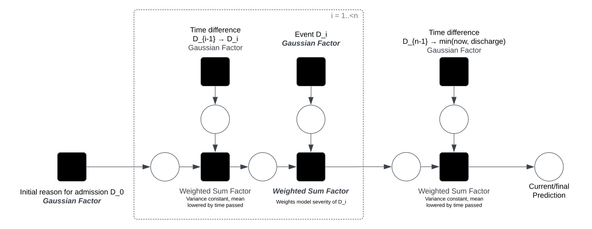

# VWD factor graph model

## Basic model

Main assumption: All data points that are recorded during stay have

- independent,
- additive,
- normally distributed

influence on the patient's length of stay.

## Issues

> Order matters: the later something happens, the bigger its influence (first
> data points are scaled down more often)

- Could also fix sum weights to $1$, then this isn't the case anymore, but
- order & time passed would become irrelevant (associative sum)
- What's better?

> How do we deal with irregular observations, e.g. patient A has temperature
> taken every day, patient B only once a week?

- Maybe we don't: Can we assign meaning to a measurement being made more or less
  often?

> How do we find the parameters of the emphasized factors (weighted sum weights
> $a, b$ and parameters of Gaussians $\tau, \rho$)?

- Construct factor graphs for all training samples with subsets $D_{[0...i]}$
  for all $i<n$
- Then perform gradient descent to find weights/parameters?
  - Continuous records (e.g. temperature) would model function that maps
    temperature onto parameters

## Outcomes

- very explainable & easy to understand model
- we would model a normal distribution for each record, i.e. we could say "if
  your temperature is measured at $x$" or "if you are diagnosed with $y$", you are
  80% likely to stay in the hospital for $n$ additional days
  - $\to$ very interesting, in particular to compare our diagnosis distributions
    with catalog stays
