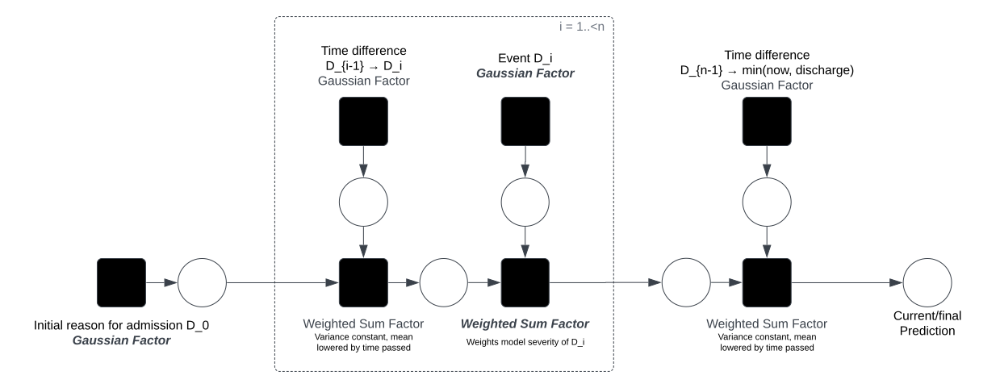

# VWD factor graph model

## Issues

> How do we find the parameters of the emphasized factors (weighted sum weights
> $a, b$ and parameters of Gaussians $\tau, \rho$)?

- slap gradient descent on it?

> Influence of event $D_i$ gets smaller with increasing $i$

- might be mitigable by adjusting the weights by index but does this give us
  precision problems?
